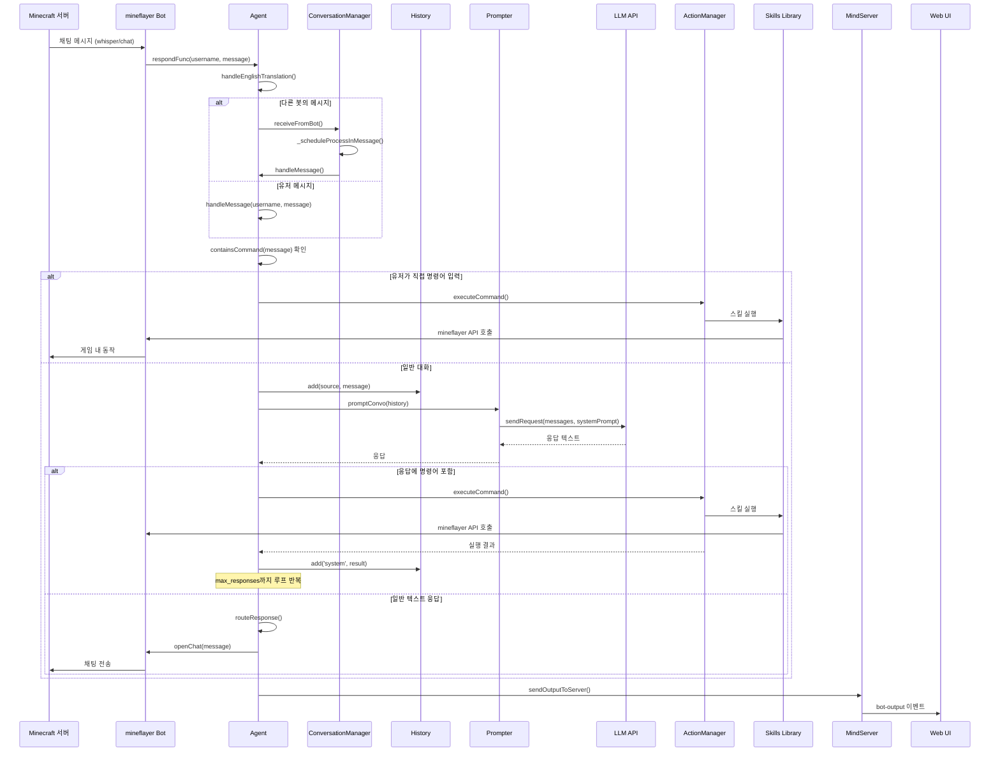
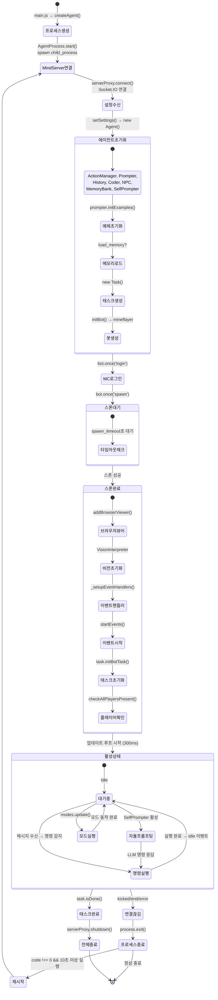
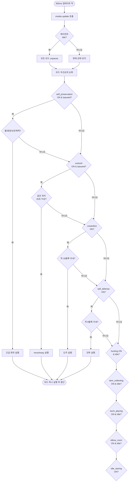
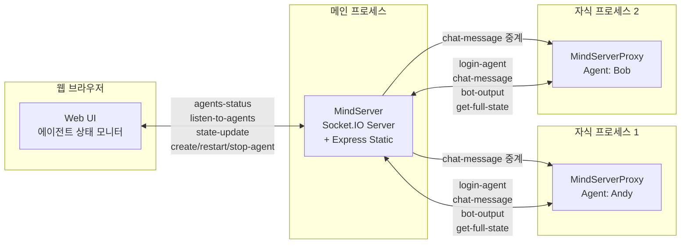

# Mindcraft 아키텍처

## 진입점

### `main.js`
애플리케이션의 최상위 진입점. CLI 인자를 파싱하고 (`--profiles`, `--task_path`, `--task_id`), 환경 변수로 설정을 오버라이드한 뒤, `Mindcraft.init()`으로 MindServer를 시작하고 각 프로필에 대해 `Mindcraft.createAgent()`를 호출한다.

### `settings.js`
전역 설정 객체를 정의하고 export한다. Minecraft 서버 접속 정보, MindServer 포트, 프로필 경로, 채팅/음성/비전 설정, 코딩 허용 여부, 최대 메시지 수 등을 포함한다. `SETTINGS_JSON` 환경 변수로 런타임에 오버라이드 가능.

---

## 전체 시스템 아키텍처

```mermaid
graph TB
    subgraph "메인 프로세스"
        MAIN["main.js<br/>CLI 진입점"]
        SETTINGS["settings.js<br/>전역 설정"]
        MC["mindcraft.js<br/>에이전트 생성/관리"]
        MS["mindserver.js<br/>Socket.IO 허브 + Web UI"]
        MCS["mcserver.js<br/>MC 서버 탐지"]
    end

    subgraph "자식 프로세스 (에이전트별)"
        AP["agent_process.js<br/>프로세스 스폰"]
        IA["init_agent.js<br/>에이전트 초기화"]
        MSP["mindserver_proxy.js<br/>MindServer 연결 프록시"]
        AGENT["agent.js<br/>핵심 에이전트 로직"]
    end

    subgraph "에이전트 컴포넌트"
        PROMPTER["prompter.js<br/>LLM 프롬프트 엔진"]
        HISTORY["history.js<br/>대화 이력/메모리"]
        CODER["coder.js<br/>코드 생성/실행"]
        AM["action_manager.js<br/>액션 실행 관리"]
        SP["self_prompter.js<br/>자율 프롬프팅"]
        CONV["conversation.js<br/>봇간 대화 관리"]
        NPC["npc/controller.js<br/>NPC 목표 관리"]
        MODES["modes.js<br/>자동 행동 모드"]
        VISION["vision/<br/>비전 시스템"]
        TASK["tasks/<br/>태스크 시스템"]
        CMDS["commands/<br/>명령 시스템"]
        MB["memory_bank.js<br/>위치 기억"]
    end

    subgraph "LLM 프로바이더"
        GPT["gpt.js (OpenAI)"]
        CLAUDE["claude.js (Anthropic)"]
        GEMINI["gemini.js (Google)"]
        OLLAMA["ollama.js (로컬)"]
        OTHERS["기타 18개 프로바이더"]
    end

    subgraph "스킬 라이브러리"
        SKILLS["skills.js<br/>Minecraft 동작들"]
        WORLD["world.js<br/>월드 쿼리"]
        MCDATA["mcdata.js<br/>MC 데이터 유틸"]
    end

    MAIN --> SETTINGS
    MAIN --> MC
    MC --> MS
    MC --> MCS
    MC --> AP

    AP -->|"child_process.spawn"| IA
    IA --> MSP
    IA --> AGENT
    MSP -->|"Socket.IO"| MS

    AGENT --> PROMPTER
    AGENT --> HISTORY
    AGENT --> CODER
    AGENT --> AM
    AGENT --> SP
    AGENT --> CONV
    AGENT --> NPC
    AGENT --> MODES
    AGENT --> VISION
    AGENT --> TASK
    AGENT --> CMDS
    AGENT --> MB

    PROMPTER --> GPT
    PROMPTER --> CLAUDE
    PROMPTER --> GEMINI
    PROMPTER --> OLLAMA
    PROMPTER --> OTHERS

    CMDS --> SKILLS
    CMDS --> WORLD
    CODER --> SKILLS
    CODER --> WORLD
    MODES --> SKILLS
    MODES --> WORLD
    NPC --> SKILLS
    NPC --> WORLD
    SKILLS --> MCDATA
    WORLD --> MCDATA

    click MAIN "https://github.com/perlica-s-playground/mindcraft/blob/main/main.js"
    click SETTINGS "https://github.com/perlica-s-playground/mindcraft/blob/main/settings.js"
    click MC "https://github.com/perlica-s-playground/mindcraft/blob/main/src/mindcraft/mindcraft.js"
    click MS "https://github.com/perlica-s-playground/mindcraft/blob/main/src/mindcraft/mindserver.js"
    click MCS "https://github.com/perlica-s-playground/mindcraft/blob/main/src/mindcraft/mcserver.js"
    click AP "https://github.com/perlica-s-playground/mindcraft/blob/main/src/process/agent_process.js"
    click IA "https://github.com/perlica-s-playground/mindcraft/blob/main/src/process/init_agent.js"
    click MSP "https://github.com/perlica-s-playground/mindcraft/blob/main/src/agent/mindserver_proxy.js"
    click AGENT "https://github.com/perlica-s-playground/mindcraft/blob/main/src/agent/agent.js"
    click PROMPTER "https://github.com/perlica-s-playground/mindcraft/blob/main/src/models/prompter.js"
    click HISTORY "https://github.com/perlica-s-playground/mindcraft/blob/main/src/agent/history.js"
    click CODER "https://github.com/perlica-s-playground/mindcraft/blob/main/src/agent/coder.js"
    click AM "https://github.com/perlica-s-playground/mindcraft/blob/main/src/agent/action_manager.js"
    click SP "https://github.com/perlica-s-playground/mindcraft/blob/main/src/agent/self_prompter.js"
    click CONV "https://github.com/perlica-s-playground/mindcraft/blob/main/src/agent/conversation.js"
    click NPC "https://github.com/perlica-s-playground/mindcraft/blob/main/src/agent/npc/controller.js"
    click MODES "https://github.com/perlica-s-playground/mindcraft/blob/main/src/agent/modes.js"
    click MB "https://github.com/perlica-s-playground/mindcraft/blob/main/src/agent/memory_bank.js"
    click GPT "https://github.com/perlica-s-playground/mindcraft/blob/main/src/models/gpt.js"
    click CLAUDE "https://github.com/perlica-s-playground/mindcraft/blob/main/src/models/claude.js"
    click GEMINI "https://github.com/perlica-s-playground/mindcraft/blob/main/src/models/gemini.js"
    click OLLAMA "https://github.com/perlica-s-playground/mindcraft/blob/main/src/models/ollama.js"
    click SKILLS "https://github.com/perlica-s-playground/mindcraft/blob/main/src/agent/library/skills.js"
    click WORLD "https://github.com/perlica-s-playground/mindcraft/blob/main/src/agent/library/world.js"
    click MCDATA "https://github.com/perlica-s-playground/mindcraft/blob/main/src/utils/mcdata.js"
```

---

## 메시지/이벤트 흐름

---

## 에이전트 라이프사이클

---

## 봇 의사결정 흐름

```mermaid
flowchart TD
    START([메시지 수신]) --> CHECK_EMPTY{메시지가 비어있거나<br/>자기 자신?}
    CHECK_EMPTY -->|예| IGNORE([무시])
    CHECK_EMPTY -->|아니오| CHECK_FILTER{only_chat_with<br/>필터 통과?}
    CHECK_FILTER -->|아니오| IGNORE
    CHECK_FILTER -->|예| TRANSLATE[영어로 번역]

    TRANSLATE --> CHECK_BOT{다른 봇의<br/>메시지?}
    CHECK_BOT -->|예| CONVO_MGR[ConversationManager<br/>에서 처리]
    CONVO_MGR --> SCHEDULE{대화 스케줄링<br/>양쪽 상태 확인}
    SCHEDULE -->|둘 다 바쁨| WAIT_OR_SKIP{talkOver<br/>액션?}
    WAIT_OR_SKIP -->|예| FAST_RESPOND[200ms 후 응답]
    WAIT_OR_SKIP -->|아니오| DEFER([응답 보류])
    SCHEDULE -->|상대만 바쁨| LONG_DELAY[5000ms 후 응답]
    SCHEDULE -->|내가 바쁨| ASK_LLM{LLM에게<br/>응답 여부 질문}
    ASK_LLM -->|응답| FAST_RESPOND
    ASK_LLM -->|무시| DEFER
    SCHEDULE -->|둘 다 여유| FAST_RESPOND

    CHECK_BOT -->|아니오| HANDLE_MSG[handleMessage 진입]

    FAST_RESPOND --> HANDLE_MSG
    LONG_DELAY --> HANDLE_MSG

    HANDLE_MSG --> USER_CMD{유저가 직접<br/>명령어 입력?}
    USER_CMD -->|예| EXEC_CMD[명령어 바로 실행]
    USER_CMD -->|아니오| ADD_HISTORY[History에 추가]

    ADD_HISTORY --> FLUSH_LOG[모드 행동 로그 플러시]
    FLUSH_LOG --> LLM_CALL[Prompter.promptConvo<br/>LLM 호출]

    LLM_CALL --> PARSE_RESP{응답에 명령어<br/>포함?}
    PARSE_RESP -->|아니오| CHAT_RESP[채팅으로 응답<br/>routeResponse]
    PARSE_RESP -->|예| VALIDATE_CMD{명령어 존재?}
    VALIDATE_CMD -->|아니오| HALLUCINATE[환각 경고<br/>다시 시도]
    HALLUCINATE --> LLM_CALL
    VALIDATE_CMD -->|예| CHECK_INTERRUPT{인터럽트<br/>필요?}
    CHECK_INTERRUPT -->|예| STOP_LOOP([루프 중단])
    CHECK_INTERRUPT -->|아니오| EXEC_CMD2[명령어 실행]

    EXEC_CMD2 --> HAS_RESULT{실행 결과<br/>있음?}
    HAS_RESULT -->|예| ADD_RESULT[결과를 History에 추가]
    ADD_RESULT --> MAX_CHECK{max_responses<br/>도달?}
    MAX_CHECK -->|아니오| LLM_CALL
    MAX_CHECK -->|예| END_LOOP([루프 종료])
    HAS_RESULT -->|아니오| END_LOOP

    EXEC_CMD --> DONE([완료])
    CHAT_RESP --> DONE
    END_LOOP --> DONE
    STOP_LOOP --> DONE

    click CONVO_MGR "https://github.com/perlica-s-playground/mindcraft/blob/main/src/agent/conversation.js"
    click HANDLE_MSG "https://github.com/perlica-s-playground/mindcraft/blob/main/src/agent/agent.js"
    click ADD_HISTORY "https://github.com/perlica-s-playground/mindcraft/blob/main/src/agent/history.js"
    click LLM_CALL "https://github.com/perlica-s-playground/mindcraft/blob/main/src/models/prompter.js"
    click EXEC_CMD "https://github.com/perlica-s-playground/mindcraft/blob/main/src/agent/commands/index.js"
    click EXEC_CMD2 "https://github.com/perlica-s-playground/mindcraft/blob/main/src/agent/commands/index.js"
    click TRANSLATE "https://github.com/perlica-s-playground/mindcraft/blob/main/src/utils/translator.js"
```

---

## 모드 업데이트 흐름

---

## MindServer 통신 아키텍처

