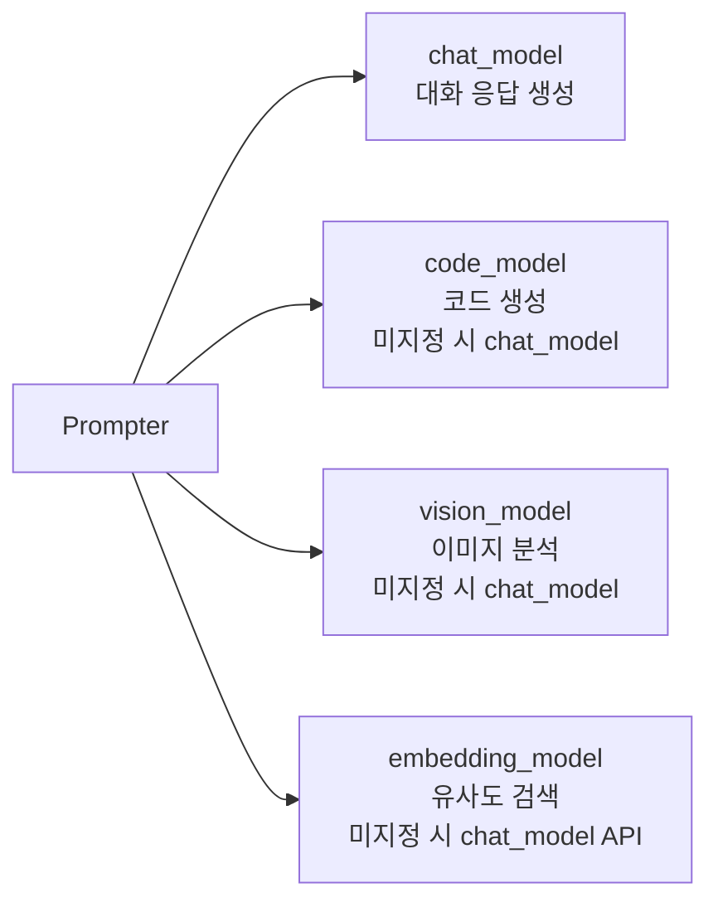

# LLM 모델 통합

## 개요

Mindcraft는 다양한 LLM 프로바이더를 플러그인 방식으로 지원한다. `_model_map.js`가 디렉토리 내 모든 모델 클래스를 자동 발견하여 `static prefix` 기반으로 라우팅한다.

## 모델 선택 및 생성

### `_model_map.js`

```
프로필 문자열 (예: "google/gemini-2.5-flash")
    ↓
selectAPI() → prefix 분리 → profile.api = "google", profile.model = "gemini-2.5-flash"
    ↓
createModel() → apiMap["google"] → new Gemini("gemini-2.5-flash", url, params)
```

- 디렉토리 내 `.js` 파일을 동적으로 `import()`하여 `static prefix` 프로퍼티가 있는 클래스를 수집
- `selectAPI(profile)`: 문자열 또는 객체 프로필에서 API 종류를 결정
  - 명시적 prefix (`google/`, `openai/`, `anthropic/` 등) 또는 모델명 패턴 매칭
  - `local` → `ollama` 하위 호환
- `createModel(profile)`: 해당 API 클래스의 인스턴스 생성

---

## 공통 인터페이스

모든 모델 클래스는 다음 메서드를 구현한다:

| 메서드 | 설명 |
|--------|------|
| `sendRequest(turns, systemMessage, stop_seq?)` | 대화 완성 요청. turns는 `{role, content}[]` 배열 |
| `sendVisionRequest(turns, systemMessage, imageBuffer)` | 이미지 포함 요청 (비전 지원 모델만) |
| `embed(text)` | 텍스트 임베딩 벡터 반환 (일부 모델만) |

### 메시지 포맷팅

- `strictFormat(turns)`: 모든 프로바이더가 사용하는 공통 포맷터
  - `system` 역할 → `user` 역할 + `"SYSTEM: "` 접두사
  - 연속 `assistant` 메시지 사이에 빈 `user` 메시지 삽입
  - 연속 `user` 메시지는 합침
  - 첫 메시지가 `user`가 아니면 더미 삽입 (Anthropic 요구사항)

---

## 프로바이더별 상세

### OpenAI (`GPT`) — prefix: `openai`
- **SDK**: `openai` 패키지
- **기본 모델**: `gpt-4o-mini`
- **특징**:
  - 커스텀 URL 설정 시 `chat.completions` 사용, 아니면 `responses` API 사용
  - `o1`/`o3`/`5` 모델은 `stop` 파라미터 제거
  - 컨텍스트 초과 시 자동으로 턴 축소 재시도
  - `stop_seq`(기본 `***`)로 응답 경계 제어
- **비전**: `input_image` 타입으로 base64 이미지 전송
- **임베딩**: `text-embedding-3-small` 기본, 최대 8191자
- **TTS**: `TTSConfig.sendAudioRequest()` — OpenAI Audio Speech API

### Anthropic (`Claude`) — prefix: `anthropic`
- **SDK**: `@anthropic-ai/sdk`
- **기본 모델**: `claude-sonnet-4-20250514`
- **특징**:
  - `max_tokens` 자동 설정 (thinking 사용 시 budget + 1000, 기본 4096)
  - 응답에서 `type: 'text'`인 콘텐츠 블록 추출
- **비전**: `type: "image"` + `source.type: "base64"` 형식
- **임베딩**: 미지원 (에러 throw)

### Google Gemini (`Gemini`) — prefix: `google`
- **SDK**: `@google/genai`
- **기본 모델**: `gemini-2.5-flash`
- **특징**:
  - 모든 안전 카테고리를 `BLOCK_NONE`으로 설정
  - 역할 매핑: `assistant` → `model`, 나머지 → `user`
  - `systemInstruction`으로 시스템 메시지 전달
- **비전**: `inlineData`로 base64 이미지 배열 전송 (다중 이미지 지원)
- **임베딩**: `gemini-embedding-001` 기본
- **TTS**: PCM 오디오를 WAV 헤더로 래핑하여 반환

### Ollama (`Ollama`) — prefix: `ollama`
- **네이티브 HTTP**: `fetch`로 직접 API 호출
- **기본 URL**: `http://127.0.0.1:11434`
- **기본 모델**: `sweaterdog/andy-4:micro-q8_0`
- **특징**:
  - 최대 5회 재시도
  - `<think>` 태그 처리 (DeepSeek-R1 호환)
  - 빈 응답 시 자동 재시도
- **임베딩**: `/api/embeddings` 엔드포인트

### DeepSeek (`DeepSeek`) — prefix: `deepseek`
- **SDK**: `openai` 패키지 (호환 API)
- **기본 URL**: `https://api.deepseek.com`
- **기본 모델**: `deepseek-chat`
- **특징**: `</think>` 태그 자동 제거

### Groq (`GroqCloudAPI`) — prefix: `groq`
- **SDK**: `groq-sdk`
- **특징**: `tools` 파라미터 자동 제거

### xAI Grok (`Grok`) — prefix: `xai`
- **SDK**: `openai` 패키지 (호환 API)
- **기본 URL**: `https://api.x.ai/v1`
- **기본 모델**: `grok-3-mini-latest`

### Mistral (`Mistral`) — prefix: `mistral`
- **SDK**: `@mistralai/mistralai`
- **비전**: `image_url` 형식 base64 전송

### Qwen (`Qwen`) — prefix: `qwen`
- **SDK**: `openai` 패키지 (호환 API)
- **기본 URL**: `https://dashscope.aliyuncs.com/compatible-mode/v1`
- **기본 모델**: `qwen-plus`

### Replicate (`ReplicateAPI`) — prefix: `replicate`
- **SDK**: `replicate`
- **특징**: `toSinglePrompt()`으로 단일 프롬프트 변환
- **기본 모델**: `meta/meta-llama-3-70b-instruct`

### HuggingFace (`HuggingFace`) — prefix: `huggingface`
- **SDK**: `@huggingface/inference`
- **특징**: `<think>` 블록 자동 재시도 (최대 5회)
- **기본 모델**: `meta-llama/Meta-Llama-3-8B`

### OpenRouter (`OpenRouter`) — prefix: `openrouter`
- **SDK**: `openai` 패키지 (호환 API)
- **기본 URL**: `https://openrouter.ai/api/v1`

### Azure (`AzureGPT`) — prefix: `azure`
- **상속**: `GPT` 클래스 확장
- **SDK**: `AzureOpenAI`
- **특징**: deployment 기반 모델 지정

### 기타 프로바이더
| 클래스 | prefix | 기본 URL/모델 |
|--------|--------|---------------|
| `Cerebras` | `cerebras` | Cerebras SDK |
| `GLHF` | `glhf` | `https://glhf.chat/api/openai/v1` |
| `Hyperbolic` | `hyperbolic` | `https://api.hyperbolic.xyz/v1/chat/completions` |
| `Mercury` | `mercury` | `https://api.inceptionlabs.ai/v1` |
| `Novita` | `novita` | `https://api.novita.ai/v3/openai` |
| `VLLM` | `vllm` | `http://0.0.0.0:8000/v1` (self-hosted) |

---

## Prompter에서의 모델 사용

`Prompter` 클래스는 프로필에서 최대 4개의 모델 인스턴스를 생성한다:



- **프로필 키**: `model`, `code_model`, `vision_model`, `embedding`
- 각 키에 `"provider/model-name"` 형식 문자열 또는 `{api, model, url, params}` 객체 지정 가능

---

## API 키 관리

`src/utils/keys.js`에서 관리:
1. `./keys.json` 파일에서 로드 시도
2. 없으면 환경 변수에서 조회
3. 둘 다 없으면 에러 throw

지원 키: `OPENAI_API_KEY`, `ANTHROPIC_API_KEY`, `GEMINI_API_KEY`, `DEEPSEEK_API_KEY`, `GROQCLOUD_API_KEY`, `XAI_API_KEY`, `MISTRAL_API_KEY`, `QWEN_API_KEY`, `REPLICATE_API_KEY`, `HUGGINGFACE_API_KEY`, `OPENROUTER_API_KEY`, `AZURE_OPENAI_API_KEY`, `CEREBRAS_API_KEY`, `GHLF_API_KEY`, `HYPERBOLIC_API_KEY`, `MERCURY_API_KEY`, `NOVITA_API_KEY`, `OPENAI_ORG_ID`
